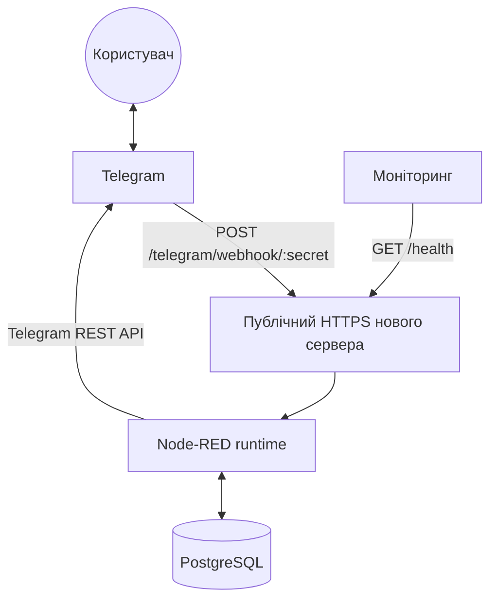
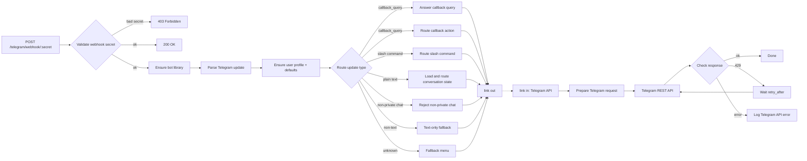

# Архітектура Telegram Birthday Bot

## 1. Загальна схема



На сервері мають бути запущені:

- **Node-RED** з user directory `src/`.
- **PostgreSQL** зі схемою з `database/init.sql`.
- **Публічний HTTPS endpoint**, який веде до HTTP-вузлів Node-RED.
- **Змінні середовища** з `.env`: токен Telegram, webhook secret, доступи до PostgreSQL, timezone і секрет Node-RED credentials.

Адмінка Node-RED знаходиться на `/admin`, бо це задано в `src/settings.js`. Для продакшену її треба захистити через `adminAuth`, VPN, firewall або правила reverse proxy.

## 2. Runtime і файли

Головні файли:

| Файл | Роль |
| :--- | :--- |
| `src/flows.json` | Основний Node-RED flow з routing, командами, callbacks, станами діалогу, нагадуваннями і доставкою в Telegram |
| `src/settings.js` | Налаштування Node-RED runtime: `flows.json`, `/admin`, credential secret, external modules |
| `src/package.json` | Залежності для function nodes, зараз потрібен `pg` |
| `database/init.sql` | Схема PostgreSQL |
| `scripts/start-node-red.sh` | Локальний або серверний запуск Node-RED з `.env` |
| `scripts/set-webhook.sh` | Реєстрація Telegram webhook на новий HTTPS-домен |
| `scripts/webhook-info.sh` | Перевірка поточного webhook у Telegram |

Node-RED запускається командою:

```bash
./scripts/start-node-red.sh
```

Скрипт читає `.env` і запускає:

```bash
node-red --userDir src
```

## 3. Webhook на новому сервері

Telegram надсилає оновлення на:

```text
https://<ваш-домен>/telegram/webhook/<TELEGRAM_WEBHOOK_SECRET>
```

Цей URL реєструється скриптом:

```bash
./scripts/set-webhook.sh https://<ваш-домен>
```

Скрипт викликає Telegram `setWebhook` і передає:

- `url`: повний webhook URL з secret у path.
- `secret_token`: той самий `TELEGRAM_WEBHOOK_SECRET`.
- `allowed_updates`: тільки `message` і `callback_query`.
- `drop_pending_updates: true`: старі накопичені updates скидаються при реєстрації.

У Node-RED webhook приймає вузол `POST /telegram/webhook/:secret`.

Вузол `Validate webhook secret` перевіряє одразу дві речі:

- secret у URL: `/telegram/webhook/:secret`;
- заголовок Telegram: `X-Telegram-Bot-Api-Secret-Token`.

Якщо перевірка не проходить, flow повертає `403 Forbidden`. Якщо все добре, Node-RED одразу повертає Telegram `200 OK` і паралельно продовжує обробку update всередині flow.

## 4. Потік одного повідомлення



Ключова ідея: webhook endpoint відповідає Telegram швидко, а всі повідомлення користувачу надсилаються окремими REST-запитами до Telegram API.

## 5. Node-RED flow

У `src/flows.json` flow розбитий на логічні групи:

| Група | Що робить |
| :--- | :--- |
| `Webhook and routing` | Приймає webhook, перевіряє secret, парсить update, створює або оновлює користувача, маршрутизує тип update |
| `Slash commands` | Обробляє `/start`, `/menu`, `/help`, `/cancel`, `/add`, `/list`, `/search`, `/delete`, `/settings` |
| `Dialog states` | Веде покрокові сценарії: додавання контакту, пошук, видалення, ручне налаштування днів і часу нагадувань |
| `Inline button callbacks` | Обробляє inline-кнопки меню, списку, видалення, налаштувань і підтвердження дій |
| `Scheduled reminders` | Раз на хвилину шукає нагадування, які треба відправити саме зараз |
| `Telegram REST delivery` | Готує і відправляє всі Telegram API запити через один спільний вузол |
| `Flow error handling` | Ловить runtime-помилки flow і, якщо задано `ADMIN_CHAT_ID`, надсилає адміну alert у Telegram |

Видимі зв'язки між великими групами зроблені через `link out` / `link in`. Це прибирає десятки довгих проводів і залишає одну точку доставки: `→ Telegram API`.

## 6. Спільна бібліотека `birthdayBot`

При deploy спрацьовує inject-вузол `Init on deploy`, який запускає `Initialize bot library`.

Цей вузол:

- створює PostgreSQL connection pool `pgPool`;
- збирає helper-функції для SQL, Telegram REST payloads, меню, форматування, валідації та бізнес-логіки;
- записує об'єкт `birthdayBot` у `flow` context;
- закриває `pgPool` у `finalize`, коли Node-RED перевантажує flow.

Handler-вузли не дублюють логіку. Вони дістають `birthdayBot` з `flow` context і викликають методи на кшталт:

- `commandStart`, `commandList`, `commandSettings`;
- `stateContactName`, `stateBirthDate`, `stateUsername`;
- `callbackList`, `callbackDeleteConfirm`, `callbackToggle`;
- `loadReminderCandidates`, `filterDueReminders`, `logReminderIfNew`, `buildReminderMessage`.

Перед webhook і scheduled reminders стоїть `Ensure bot library`. Якщо бібліотека ще не ініціалізована, flow не продовжує роботу і піднімає помилку.

## 7. Telegram REST API

Готові Telegram-ноди для Node-RED не використовуються. Замість них flow напряму працює з офіційним Telegram Bot API:

```text
https://api.telegram.org/bot<TELEGRAM_BOT_TOKEN>/<method>
```

Основні методи:

- `sendMessage` для повідомлень користувачу;
- `answerCallbackQuery` для швидкого підтвердження натискання inline-кнопки.

Кожен handler повертає один або кілька request descriptors:

```json
{
  "method": "POST",
  "url": "https://api.telegram.org/bot<token>/sendMessage",
  "headers": { "Content-Type": "application/json" },
  "payload": {
    "chat_id": 123,
    "text": "Привіт",
    "parse_mode": "HTML"
  }
}
```

Далі `Prepare Telegram request` перетворює descriptor на HTTP request, а вузол `Telegram REST API` виконує запит.

`Check Telegram API response` перевіряє відповідь:

- `ok: true` вважається успішною доставкою;
- `429` передається в `Handle 429 Rate Limit`, який чекає `retry_after` і пробує ще раз, максимум 3 рази;
- інші помилки логуються в debug output.

## 8. PostgreSQL

PostgreSQL є єдиним постійним сховищем бота.

| Таблиця | Призначення |
| :--- | :--- |
| `app_users` | Telegram-користувачі, chat ID, username, language code, timezone |
| `contacts` | Контакти користувача, дата народження, Telegram username |
| `reminder_settings` | Чи увімкнені нагадування, за скільки днів нагадувати, час і timezone |
| `conversation_states` | Поточний крок діалогу і тимчасові дані сценарію |
| `reminder_log` | Історія вже відправлених нагадувань |

Важливі правила на рівні БД:

- `contacts` прив'язані до власника через `owner_user_id`;
- дублікати контактів для одного користувача блокуються унікальним ключем;
- `telegram_username` перевіряється регулярним виразом;
- `remind_days_before` дозволяє тільки `0, 1, 3, 7, 14, 30`;
- `reminder_log` має унікальний ключ, який не дає відправити одне й те саме нагадування двічі.

SQL-запити у flow параметризовані через `pg`, тому значення користувача не підставляються в SQL рядком.

## 9. Нагадування

Нагадування запускаються вузлом `Check reminders every minute`.

Алгоритм:

1. `Load reminder candidates` бере всіх користувачів з увімкненими нагадуваннями і їхні контакти.
2. `Filter due reminders by time/date` рахує локальний час користувача через timezone і перевіряє, чи зараз саме його `remind_time`.
3. Для кожного значення з `remind_days_before` flow перевіряє, чи день народження припадає на потрібну дату.
4. `Log reminder if not sent` записує подію в `reminder_log`.
5. Якщо запис уже існує, повідомлення не відправляється повторно.
6. `Build reminder message` формує текст і передає його в загальну доставку `→ Telegram API`.

За замовчуванням використовується timezone `Europe/Kyiv`. Для 29 лютого у невисокосні роки дата нормалізується на 1 березня.

## 10. Помилки, healthcheck і моніторинг

Для перевірки сервера є endpoint:

```text
GET /health
```

Він повертає:

- `200` і `{ "status": "ok" }`, якщо `birthdayBot` уже ініціалізований;
- `503` і `{ "status": "initializing" }`, якщо flow ще не готовий.

Runtime-помилки ловить вузол `Flow errors`. Далі `Format Error Alert` формує повідомлення адміну і відправляє його через Telegram REST API, якщо в `.env` задано `ADMIN_CHAT_ID`.

Стан HTTP-вузла Telegram API відстежує `Monitor Telegram API`. Debug-вузли для успіхів, помилок і статусів можна вмикати в редакторі Node-RED під час діагностики.

## 11. Безпека на новому сервері

У flow і конфігурації закладені такі захисти:

- webhook secret перевіряється і в URL, і в Telegram secret header;
- бот працює тільки в приватних чатах;
- SQL-запити параметризовані;
- LIKE-символи у пошуку екрануються;
- імена, дати, username, час і дні нагадувань валідуються перед записом;
- секрети не зберігаються у flow, а читаються зі змінних середовища;
- повторні нагадування блокуються унікальним ключем `reminder_log`.

Окремо на сервері треба захистити `/admin`, бо `adminAuth` у `src/settings.js` зараз закоментований.

## 12. Що змінилося порівняно зі старою схемою

- Більше немає окремого backend-коду в `src/lib/*`.
- Node-RED тепер є основним серверним runtime.
- Telegram webhook приходить напряму на новий HTTPS-сервер.
- Інтеграція з Telegram зроблена тільки через REST API, без сторонніх Telegram-ноду.
- Бізнес-логіка зібрана у `Initialize bot library` і доступна як `birthdayBot` у flow context.
- Усі відповіді користувачу проходять через одну точку `→ Telegram API`.
- Нагадування, діалоги, callback-кнопки й error alerts описані в одному `src/flows.json`.
