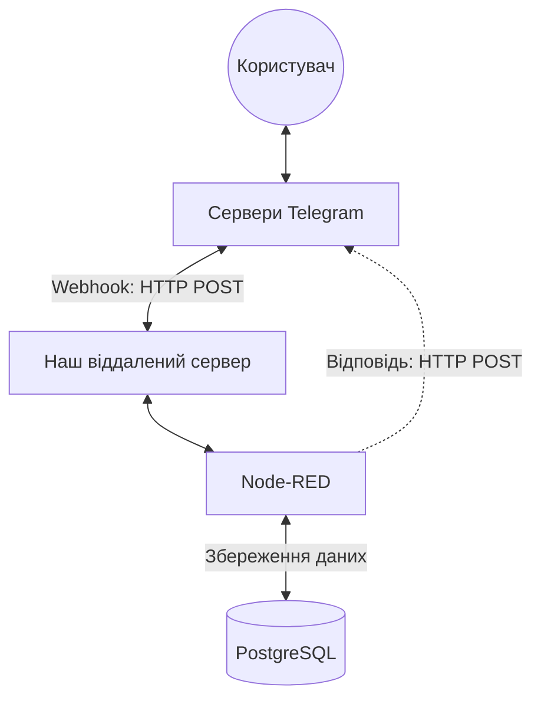

# Як працює наш бот (Архітектура)

Цей документ простою мовою пояснює, як бот спілкується з вами та як влаштована його технічна частина.

## 1. Схема взаємодії бота

Telegram спілкується з нашим сервером безпосередньо. Сервер працює цілодобово (24/7), тому жодні посередники чи тунелі не потрібні.

Уявіть, що Telegram — це поштове відділення, а наш бот — це офіс:
1. **Ваш лист**: Ви пишете повідомлення боту.
2. **Доставка**: Telegram миттєво стукає у двері нашого сервера (це називається Webhook) і передає ваше повідомлення.
3. **Обробка**: Наша програма читає повідомлення та приймає рішення.
4. **Відправка**: Програма віддає свою відповідь Telegram, а той миттєво доставляє її вам.

## 2. Робота з REST API (Без спеціальних нод)

Ми **не використовуємо** готові "Telegram-ноди" (модулі) для Node-RED. Натомість ми спілкуємось з офіційним **REST API** Telegram напряму.

Що це означає:
- Замість спеціального блоку-приймача ми використовуємо звичайний `http in`.
- Замість спеціального блоку-відправника ми використовуємо `http request`.

**Чому це краще?** Ми маємо повний контроль над ботом. Ми не залежимо від помилок сторонніх розробників нод, і бот працює набагато швидше та надійніше.

## 3. Анатомія HTTP запитів та їх різні типи

Кожного разу, коли бот хоче щось сказати, він відправляє **HTTP запит** (цифровий лист). Він складається з таких частин:

| Частина запиту | Просте пояснення | Приклад у нашому боті |
| :--- | :--- | :--- |
| **Метод (Method)** | Яку дію ми хочемо зробити | `POST` (відправити дані) |
| **Адреса (URL)** | Куди ми відправляємо | `https://api.telegram.org/bot<ТОКЕН>/sendMessage` |
| **Заголовки (Headers)**| "Конверт" з правилами | `Content-Type: application/json` |
| **Тіло (Body)** | Сам зміст (що саме відправляємо) | `{"chat_id": 123, "text": "Привіт!"}` |
| **Статус-код** | Відповідь (результат доставки) | `200` (Успіх), `403` (Заборонено), `429` (Багато запитів) |

**Які бувають типи запитів:**
- **POST**: Основний метод. Використовується для надсилання повідомлень, відповідей на кнопки тощо (99% роботи).
- **GET**: Використовується лише для запиту інформації (наприклад, перевірити, чи правильно налаштований зв'язок з ботом).

## 4. Обробка помилок

Щоб бот працював без збоїв, у нас діє багаторівневий захист:

- **Перевірка "на вході" (Валідація)**: Бот одразу перевіряє дані. Він не дозволить зберегти "31 лютого" і ввічливо попросить ввести дату правильно.
- **М'яке падіння (Try/Catch)**: Якщо в самій програмі стається непередбачуваний збій, вона не зависає. Бот автоматично повідомить вас: *"Ой, щось пішло не так"*.
- **Аналіз статус-кодів**: Бот завжди слухає відповідь від Telegram. Якщо Telegram повертає помилку (наприклад, "Error 429 - забагато запитів"), бот це розуміє і не ламається.
- **Сигналізація адміністратору**: У випадку серйозних критичних помилок бот моментально і автоматично надсилає адміну повідомлення в Telegram із детальним описом проблеми.

## 5. База даних (Наша пам'ять)

Вся інформація надійно зберігається у 5 таблицях (PostgreSQL):
- 👤 **`app_users`**: ваші базові налаштування.
- 📒 **`contacts`**: ваші збережені друзі та дати їхніх днів народження.
- ⚙️ **`reminder_settings`**: налаштування часу нагадувань.
- 🧠 **`conversation_states`**: пам'ять діалогу (щоб бот знав, що він чекає від вас введення дати чи імені).
- 📜 **`reminder_log`**: історія нагадувань, щоб не спамити.

*(Візуальну схему бази можна подивитись на dbdiagram.io, скопіювавши файл `docs/dbdiagram.dbml`)*
